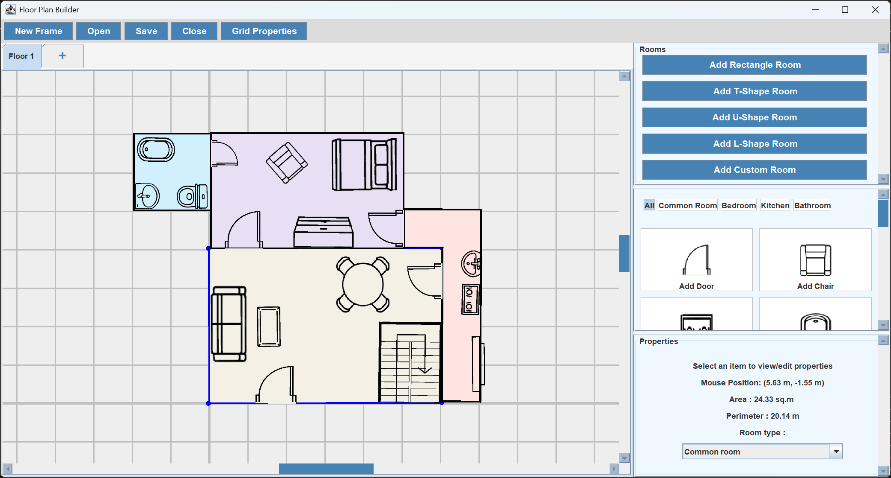

# Floor-plan-maker
A `Java Swing` based application to create and edit 2D floorplans.

## Features
- Add a preset room or create one with custom dimensions
- Move, rotate and scale rooms with overlap prevention
- Rooms can be designated as bedrooms, bathrooms, kitchens, or common areas, each with its own distinct properties
- Create multiple floors in the same floorplan, link them using staircases
- Add fixtures to the floorplan
- Move, rotate and scale fixtures
- Enable or disable assistive grid
- Assign measurement units and view properties such as area and perimeter for each room

## To add
- Save and open floorplan files
- Export as an image

## Preview

## Contributors
- Pranav P Jagathpathy
- Mahadevan M
- R Tarun Kumar
- Lokesh Lakshminarayanan 

This project was made for an evaluation component of a course, and is released under the [MIT License](LICENSE).
